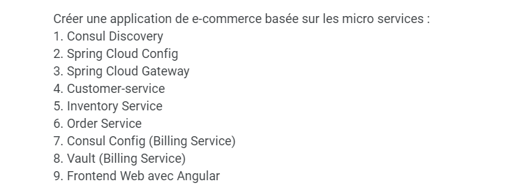
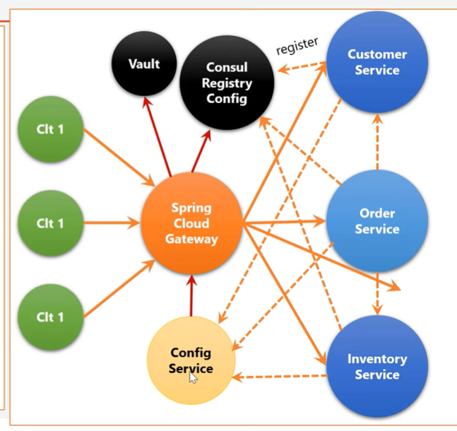

# Architecture microservice en spring avec l'implementation de consul et vault 

 

 

# Contenu :

> [👉 Partie Backend : les microservices](./frontend-ng/)

> [👉 Partie Backend : les microservices](./backend-services/)

 

 

> end .<