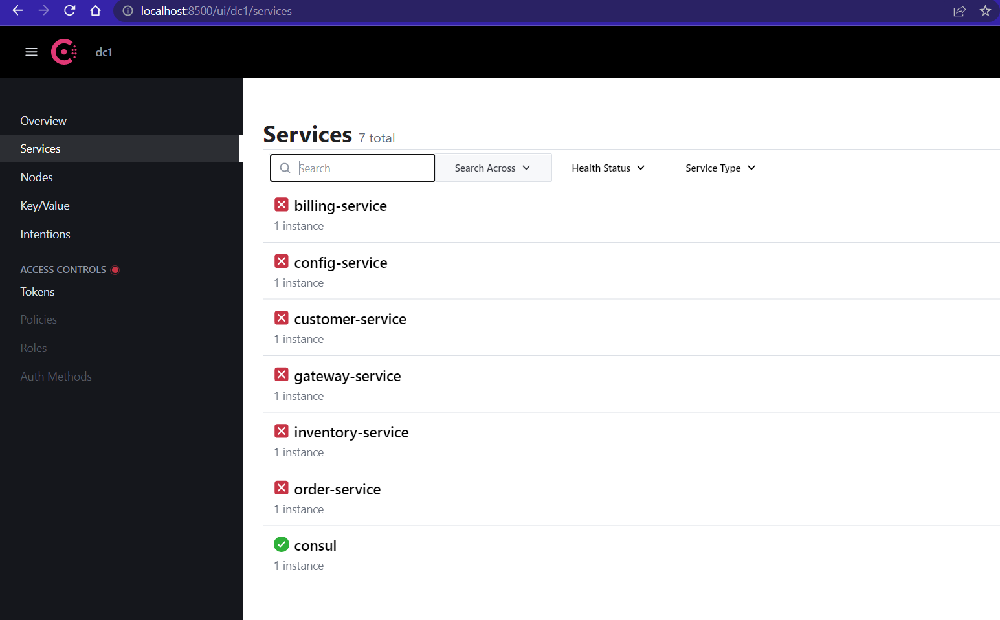
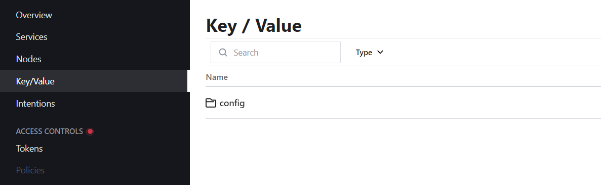
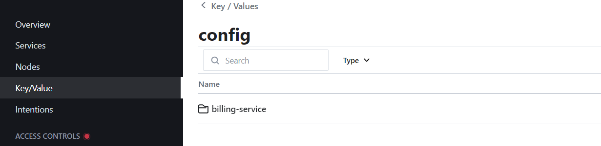
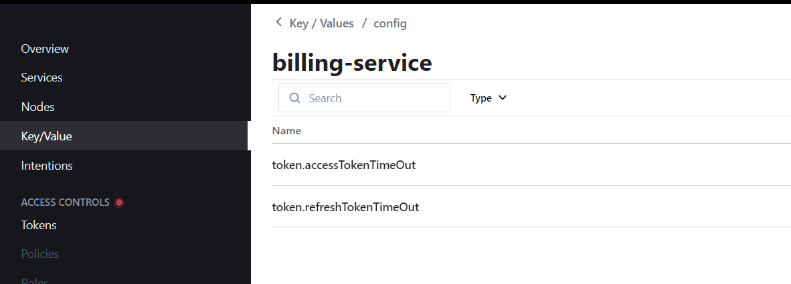
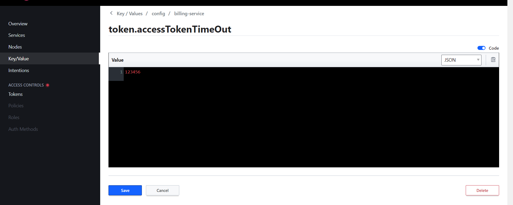
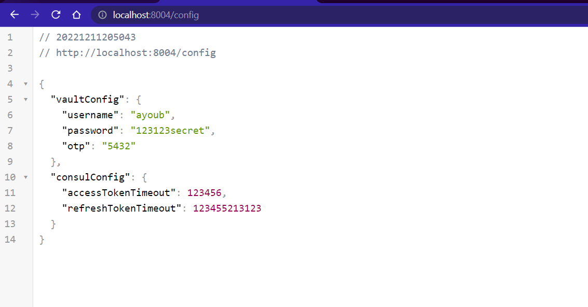

[👈 Retourner ](../)

# Consul : service de configuration et d'enregistrement


<br>

## Configuration : 

> un Script bash qui lance Consul sur un container Docker :


```bash
#!/bin/bash

# this container was used during development, later i'll use docker-compose or K8s to automate this

docker pull consul:1.13.3

string=$( docker ps -a | grep 'consul-node' )
len=`expr length "$string"`

if [[ $len -gt 0 ]]
then
  echo "👉 deleting existing consul container & volume"
  docker stop consul-node
  docker rm -v consul-node
fi

docker run -d --name consul-node --network bridge -p 8300:8300 -p 8301:8301  -p 8500:8500 -p 8600:8600 -p 8600:8600/udp -v consul-persistence-volume:/consul/data consul:1.13.3 agent -server -ui -node=server-1 -bootstrap-expect=1 -client=0.0.0.0
echo "🚀 Started consul-node container on : http://localhost:8500/"

```
[⚙ start-consul.sh ](./start-consul.sh)


=> La configuration va être importée depuis le service de configuration, et certains élément vont être (overrided) changés. 

<br>

## Enregistrement : 

* Après avoir lancé les microservices configurés comme étant des client Consul, ils sont retrouvés enregistrés automatiquement sur Consul :

<p align="center">
    
</p>

<br>

### Configuration : 

<br>

* Au niveau de l'onglet `Key/Value`, nous avons déclarer la configurations de token suivante : 
<p align="center">
    
    
    
    
</p>

* Au niveau du [billing-service](../billing-service/) nous avons créé une route qui affiche la configuration récupérée depuis Consul : 
<p align="center">
    
</p>

<br>


<br>

<br>

> end .<