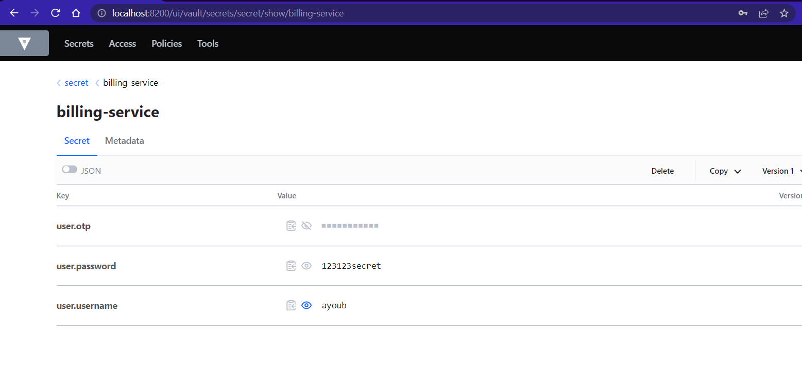
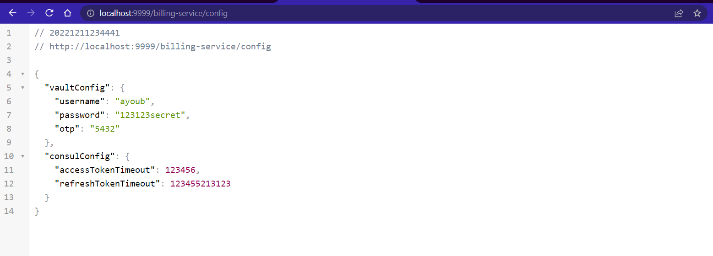
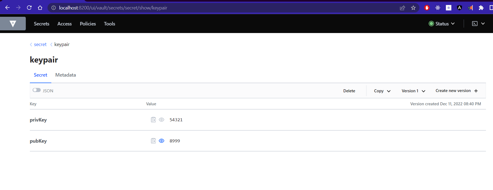

[👈 Retourner ](../)

# Vault : service de gestion de secrets (configuration priviligée)


<br>

## Configuration : 

> un Script bash qui lance Vault sur un container Docker, avec une configuration et insertion de quelques secrets dans l'espace `secret/billing-service/`  :


```bash
#!/bin/bash

# this container was used during development, later i'll use docker-compose or K8s to automate this

docker pull vault:1.12.1

rootToken='root' # token to enter application ; keep it the same as the ones used in your services

string=$( docker ps -a | grep 'vault-node' )
len=`expr length "$string"`

if [[ $len -gt 0 ]]
then
  echo "👉 deleting existing vault container & volume"
  docker stop vault-node
  docker rm -v vault-node
fi

docker run -d --name vault-node --network bridge -p 8200:8200 -p 8201:8201 -e 'VAULT_DEV_LISTEN_ADDRESS=0.0.0.0:8200' -e "VAULT_ADDR=http://127.0.0.1:8200" -e "VAULT_DEV_ROOT_TOKEN_ID=${rootToken}" -v vault-persistence-volume:/vault --cap-add=IPC_LOCK vault:1.12.1 server -dev

echo "🚀 Started vault-node container on : http://localhost:8200/"


until [ $(docker inspect -f {{.State.Running}} vault-node) == "true" ]; do
    sleep 1;
done;
sleep 5;
docker exec -u root -w / -d vault-node vault login "${rootToken}"
docker exec -u root -w / -d vault-node vault kv put secret/billing-service user.username=ayoub user.password=123123secret user.otp=5432

echo "👍 secrets added "

docker exec -u root -w / -d vault-node vault kv list secret
```
[ 👉 start-vault.sh ](./start-vault.sh)

 

<br>

## Gestion des secrets : 


* après avoir accédé vers le dashboard de vault, on trouve les secrets créés par ligne de commande dans le script précédent : 
<p align="center">
    
</p>

* Au niveau du [billing-service](../billing-service/) nous avons créé une route qui affiche les secrets récupérés depuis Vault  : 
<p align="center">
    
</p>

<br>


* Au niveau du [billing-service](../billing-service/) nous avons aussi défini un bean qui insère des secrets dans Vault, et voici les secrets insérés  : 
<p align="center">
    
</p>

<br>


<br>

<br>

> end .<