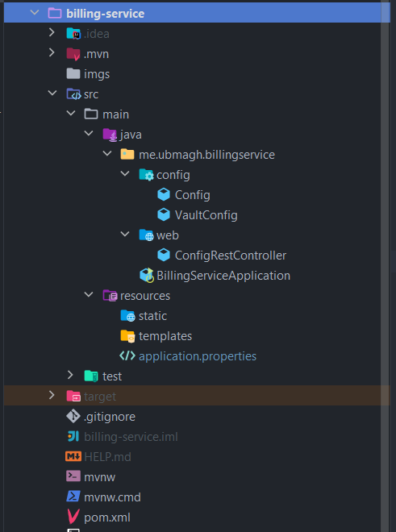
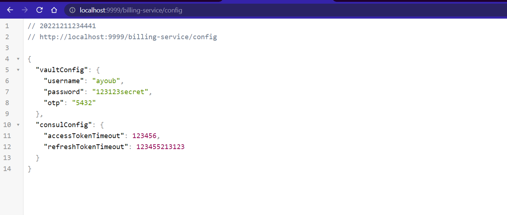
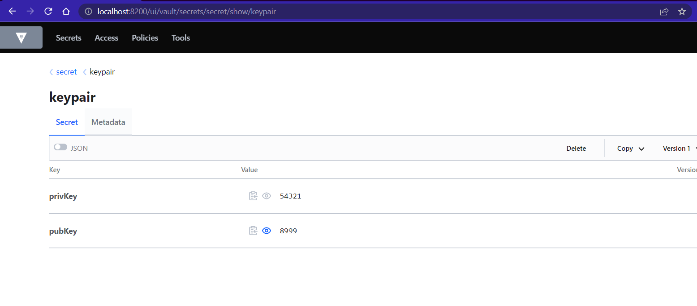

[👈 Retourner ](../)

# Inventory service :


## stack & Packages :

```
java : 17-Maven
spring : 2.7.5
packages : 
    - spring cloud : 2021.0.4
    - spring-cloud-starter-consul-discovery => S'enregistrer dans le service d'enregistrement de [consul-service](../Consul/)
    - spring-boot-starter-web
    - org.projectlombok/lombok : 1.18.24
    - spring-boot-starter-actuator
    - spring-cloud-starter-consul-config => récupérer la configuration depuis [Consul](../Consul/)
    - spring-cloud-starter-openfeign => pouvoir communiquer avec les autres microservices
    - spring-cloud-starter-vault-config => contacter le service de secrets [Vault](../Vault/)
```
-> Voir le fichier : [📦 pom.xml ](./pom.xml)

<br>

## Configuration : 

```porperties
server.port=8004
spring.application.name=billing-service

# to use many sources in the property bellow, seperate them with commas : vault, consul ...
# instead of config service, this time we'll use consul config, and secrets from vault
spring.config.import=optional:consul:, optional:vault:// 

spring.cloud.vault.token=root

# prod : https
spring.cloud.vault.scheme=http

spring.cloud.vault.kv.enabled=true
management.endpoints.web.exposure.include=*
```
[⚙ application.properties ](./src/main/resources/application.properties)


=> La configuration va être importée depuis le [service de configuration consul](../Consul/), et les secrets depuis [Vault](../Vault/)

<br>

## Application : 

### ℹ Project structure ; 

<p align="center">
    
</p>

<br>

### Config ; 

> Pour pouvoir récupérer les secrets et la configuration, nous avons créé les classes : 

* la classe `Config` pour stocker la configuration de consul :
```java
@Component
@ConfigurationProperties(prefix = "token")
@Data
public class Config {

    private long accessTokenTimeout;

    private long refreshTokenTimeout;


}
```
[👉 Config.java ](./src/main/java/me/ubmagh/billingservice/config/Config.java)

<br>

* la classe  `VaultConfig` pour stocker les secrets depuis vault :
```java
@Component
@ConfigurationProperties(prefix = "user")
@Data
public class VaultConfig {
    private String username;
    private String password;
    private String otp;
}
```
[👉 VaultConfig.java ](./src/main/java/me/ubmagh/billingservice/config/VaultConfig.java)


<br>


### Contrôlleurs :

* nous avons ajouté un controlleurs `ConfigRestController` avec une api qui retourne les configurations et secrets : 

```java
@RestController
@AllArgsConstructor
public class ConfigRestController {

    private Config config;
    private VaultConfig vaultConfig;

    @GetMapping("/config")
    public Map<String, Object> getConfig(){
        return Map.of("vaultConfig", vaultConfig, "consulConfig", config);
    }
}
```
[👉 ConfigRestController.java ](./src/main/java/me/ubmagh/billingservice/web/ConfigRestController.java)


<br>

<p align="center">
    
</p>

<br>
<br>


### 🚀 application : 

* la classe principale `~/BillingServiceApplication.java` contient un Bean qio va insérer un secret dans Vault si on veut partager/échanger par exemple des secrets entre les services :


```java
@SpringBootApplication
public class BillingServiceApplication {

    @Autowired
    private VaultTemplate vaultTemplate;

    public static void main(String[] args) {
        SpringApplication.run(BillingServiceApplication.class, args);
    }

    @Bean
    CommandLineRunner commandLineRunner(){
        return args -> {
            vaultTemplate.opsForVersionedKeyValue("secret")
                    .put("keypair", Map.of("privKey","54321","pubKey","8999"));
        };
    };
}
```

[👉 BillingServiceApplication.java ](./src/main/java/me/ubmagh/billingservice/BillingServiceApplication.java)


<br>

<p align="center">
    
</p>

<br>


<br>

> when using vault, there is no automaric refreshing of configuration, you should call POST: http://localhost:8004/actuator/refresh (http://localhost:9999/billing-service/actuator/refresh) to refresh configuration values

> end .<