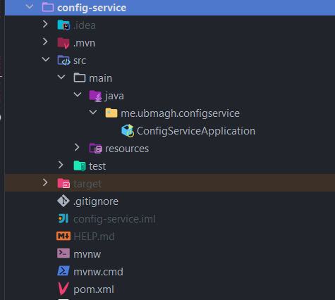
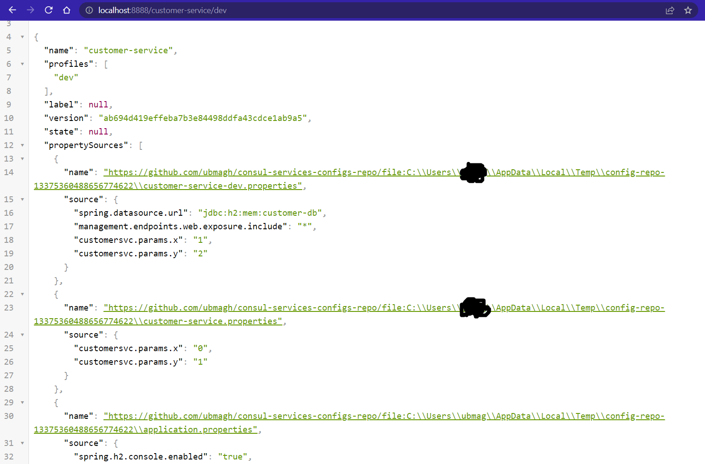
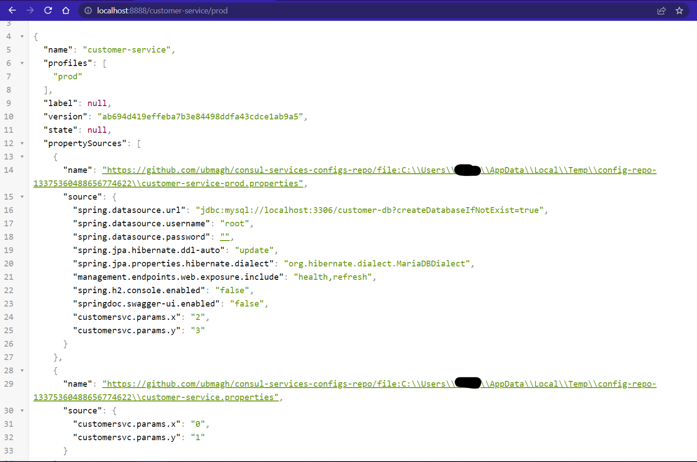

[👈 Retourner ](../)

# Config service :


## stack & Packages :

```
java : 17-Maven
spring : 2.7.5
packages : 
    - spring cloud : 2021.0.4
    - spring-cloud-starter-consul-discovery => S'enregistrer dans le service d'enregistrement de [consul-service](../Consul/)
    - spring-boot-starter-actuator
    - spring-cloud-config-server 
```
-> Voir le fichier : [📦 pom.xml ](./pom.xml)

<br>

## Configuration : 

```porperties
server.port=8888
spring.application.name=config-service
spring.cloud.config.server.git.uri=https://github.com/ubmagh/consul-services-configs-repo
management.endpoints.web.exposure.include=*
```
[⚙ application.properties ](./src/main/resources/application.properties)


=> La configuration est définie dans des fichiers selon le profile de l'application dans [👉 ce répértoire](https://github.com/ubmagh/consul-services-configs-repo)

<br>

## Application : 

### ℹ Project structure ; 

<p align="center">
    
</p>

<br>

### 🚀 main application : 

* Main app class `~/ConfigServiceApplication.java` contains along with server launch, a bean to insert some data to the H2 database :


```java
@SpringBootApplication
@EnableConfigServer
@EnableDiscoveryClient
public class ConfigServiceApplication {
    public static void main(String[] args) {
        SpringApplication.run(ConfigServiceApplication.class, args);
    }
}
```

[👉 ConfigServiceApplication.java ](./src/main/java/me/ubmagh/configservice/ConfigServiceApplication.java)


<br>

## Tester les apis pour récupérer les configurations : 


* Configuration de service Customer en dev : 

<p align="center">
    
</p>

<br>

* Configuration de service Customer en prod : 

<p align="center">
    
</p>


<br>

<br>

> end .<