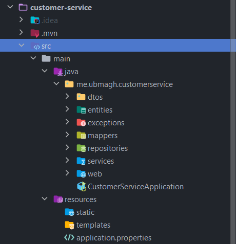

[👈 Retourner ](../)

# Customer service :


## stack & Packages :

```
java : 17-Maven
spring : 2.7.5
packages : 
    - spring cloud : 2021.0.4
    - spring-boot-starter-data-jpa
    - spring-boot-starter-data-rest
    - spring-cloud-starter-consul-discovery => S'enregistrer dans le service d'enregistrement de [consul-service](../Consul/)
    - com.h2database/h2
    - spring-boot-starter-web
    - org.projectlombok/lombok : 1.18.24
    - spring-boot-starter-actuator
    - spring-cloud-starter-config => récupérer la configuration depuis [config-service](../config-service/)
```
-> Voir le fichier : [📦 pom.xml ](./pom.xml)

<br>

## Configuration : 

```porperties
server.port=8001
spring.application.name=customer-service
spring.config.import=optional:configserver:http://localhost:8888 
```
[⚙ application.properties ](./src/main/resources/application.properties)


=> La configuration va être importée depuis le service de configuration, et certains élément vont être (overrided) changés. 

<br>

## Application : 

### ℹ Project structure ; 

<p align="center">
    
</p>

<br>

### 💻 Data Layer : 

* one single entity : `Customer` :

```java
@Entity
@Data
@AllArgsConstructor
@NoArgsConstructor
@Builder
public class Customer {
    @Id
    private String id;
    private String email;
    private String name;
}
```
[👉 Customer.java ](./src/main/java/me/ubmagh/customerservice/entities/Customer.java)

<br>

* un seul repository (interface) avec l'annotation `@RepositoryRestRessource` pour créer automatiquement toutes les apis : `CustomerRepository`

```java
@RepositoryRestResource
public interface CustomerRepository extends JpaRepository<Customer, String> {
}
```
[👉 CustomerRepository.java ](./src/main/java/me/ubmagh/customerservice/repositories/CustomerRepository.java)

<br>

* Customer Projection pour les apis data-rest  (interface) :  `CustomerProjection`

```java
@Projection( name = "full", types = Customer.class)
public interface CustomerProjection {
    public String getId();
    public String getEmail();
    public String getName();
}
```
[👉 CustomerProjection.java ](./src/main/java/me/ubmagh/customerservice/entities/CustomerProjection.java)


<br>
<br>


### 🔁 BusinessLogic Layer : 

<br>

> Automatisé par l'ajout de Data-rest 

<br>

<br>


### 🚀 main application : 

* Main app class `~/CustomerServiceApplication.java` contains along with server launch, a bean to insert some data to the H2 database :


```java
@SpringBootApplication
public class CustomerServiceApplication {
    public static void main(String[] args) {
        SpringApplication.run(CustomerServiceApplication.class, args);
    }
    @Bean
    CommandLineRunner start(CustomerService customerService){
        return args -> {
            customerService.saveCustomer( new CustomerRequestDTO( "", "AYoub", "ubmagh@gmail.com") );
            customerService.saveCustomer( new CustomerRequestDTO( "", "mohamed", "mohamed@gmail.com") );
            customerService.saveCustomer( new CustomerRequestDTO( "", "hassan", "hassan@gmail.com") );
        };
    }
}
```

[👉 CustomerServiceApplication.java ](./src/main/java/me/ubmagh/customerservice/CustomerServiceApplication.java)


<br>

### 🅿 Addtion : 

* le controlleur `RestController` suivant, permet de jouer et d'afficher la configuration actuelle, qui se change avec chaque commit dans la répétoire des configurations.

```java
@org.springframework.web.bind.annotation.RestController
@RefreshScope
public class RestController {

    @Value("${global.params.p1}")
    private String p1;

    @Value("${global.params.p2}")
    private String p2;

    @Value("${customersvc.params.x}")
    private String x;

    @Value("${customersvc.params.y}")
    private String y;

    @GetMapping("/params")
    public Map<String, String> params(){
        return Map.of( "p1", p1, "p2", p2, "x", x,"y", y );
    }

}
```


<br>

<br>

> end .<