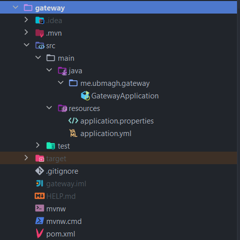
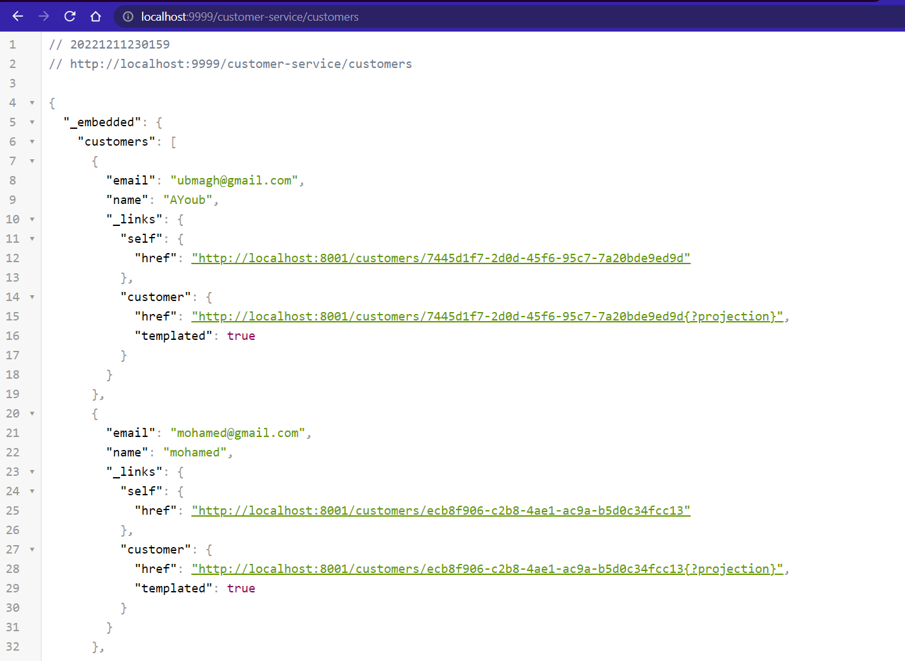
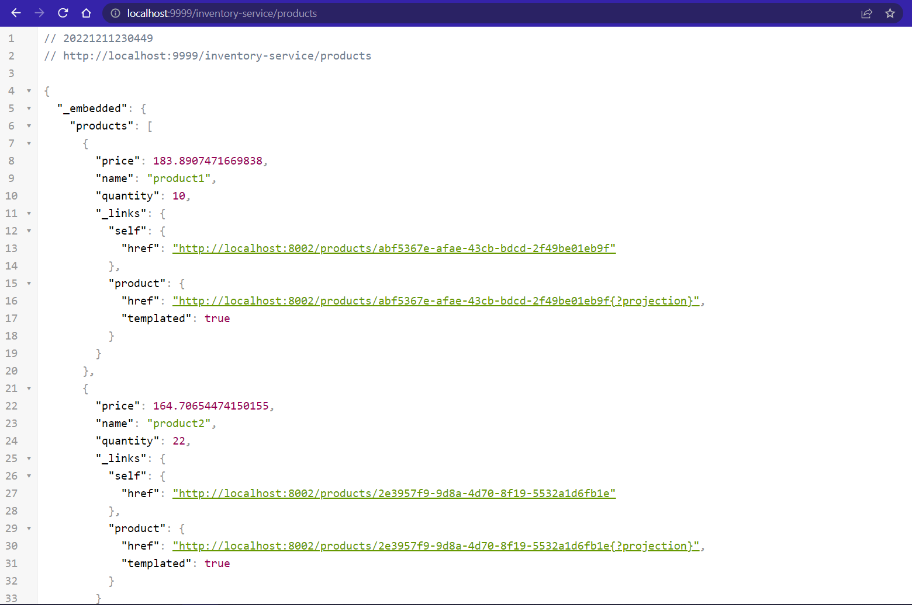
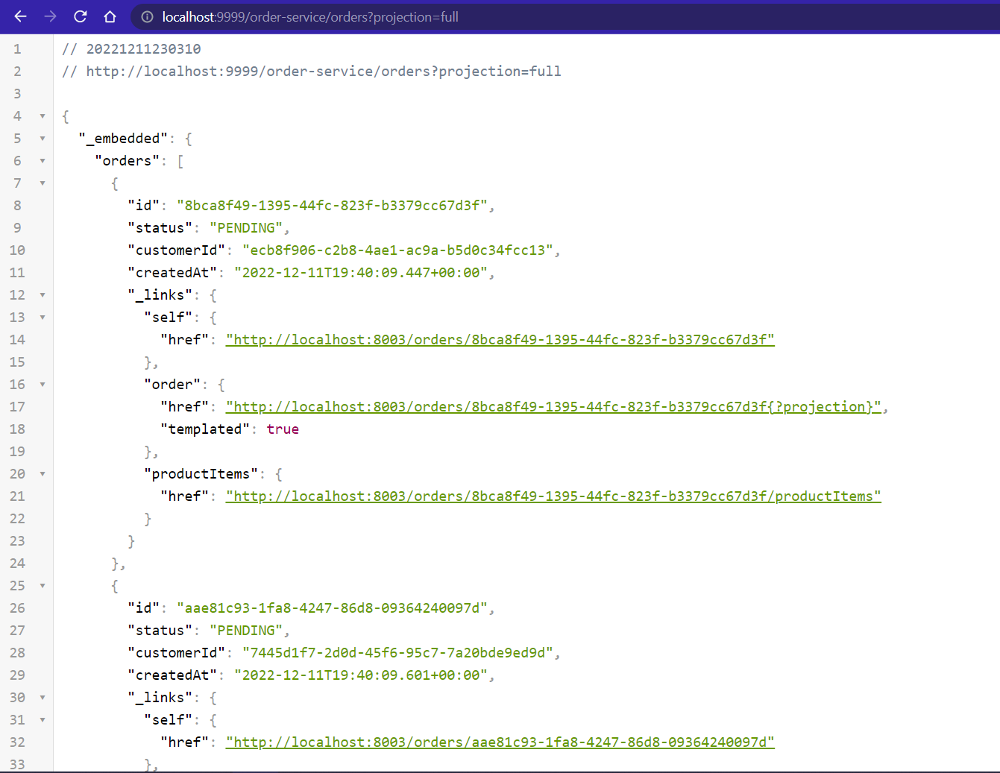
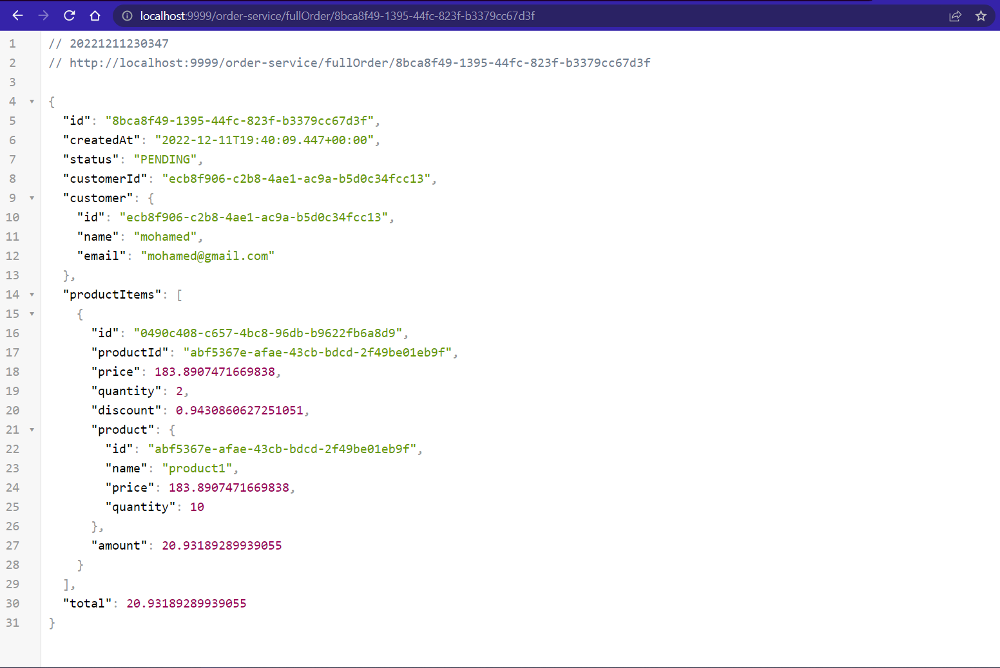

[👈 Retourner ](../)

# GateWay service :


## stack & Packages :

```
java : 17-Maven
spring : 2.7.5
packages : 
    - spring cloud : 2021.0.4
    - spring-cloud-starter-consul-discovery => S'enregistrer dans le service d'enregistrement de [consul-service](../Consul/)
    - spring-boot-starter-actuator
    - spring-cloud-starter-gateway
    - spring-cloud-starter-config
```
-> Voir le fichier : [📦 pom.xml ](./pom.xml)

<br>

## Configuration : 

```porperties
server.port=9999
spring.application.name=gateway-service
spring.config.import=optional:configserver:http://localhost:8888/
```
[⚙ application.properties ](./src/main/resources/application.properties)


=> La configuration est définie dans des fichiers selon le profile de l'application dans [👉 ce répértoire](https://github.com/ubmagh/consul-services-configs-repo)

<br>

* configuration du CORS : 

```yml
spring:
  cloud:
    gateway:
      globalcors:
        corsConfigurations:
          '[/**]':
            allowedOrigins: "http://localhost:4200"
            allowedHeaders: "*"
            allowedMethods:
              - GET
              - POST
              - PUT
              - DELETE
```
[⚙ application.yml ](./src/main/resources/application.yml)

<br>

## Application : 

### ℹ  structure du projet ; 

<p align="center">
    
</p>

<br>

### 🚀 main application : 

* Main app class `~/GatewayApplication.java` contains along with server launch, a discovery function implementation :


```java
@SpringBootApplication
public class GatewayApplication {

    public static void main(String[] args) {
        SpringApplication.run(GatewayApplication.class, args);
    }

    @Bean
    DiscoveryClientRouteDefinitionLocator dynamicRoutes(ReactiveDiscoveryClient rdc, DiscoveryLocatorProperties dlp){
        return new DiscoveryClientRouteDefinitionLocator( rdc, dlp);
    }
}
```

[👉 GatewayApplication.java ](./src/main/java/me/ubmagh/gateway/GatewayApplication.java)


<br>

## Tester la gateway : 


* vers le [microservice des clients](../customer-service/) : 

<p align="center">
    
</p>

<br>


* vers le [microservice de l'inventaire](../inventory-service/) : 

<p align="center">
    
</p>

<br>


* vers le [microservice des commandes ](../order-service/) : 

<p align="center">
    
</p>


<p align="center">
    
</p>

<br>


<br>

> end .<