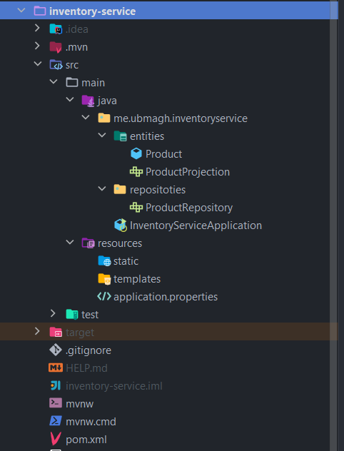

[👈 Retourner ](../)

# Inventory service :


## stack & Packages :

```
java : 17-Maven
spring : 2.7.5
packages : 
    - spring cloud : 2021.0.4
    - spring-boot-starter-data-jpa
    - spring-boot-starter-data-rest
    - spring-cloud-starter-consul-discovery => S'enregistrer dans le service d'enregistrement de [consul-service](../Consul/)
    - com.h2database/h2
    - spring-boot-starter-web
    - org.projectlombok/lombok : 1.18.24
    - spring-boot-starter-actuator
    - spring-cloud-starter-config => récupérer la configuration depuis [config-service](../config-service/)
```
-> Voir le fichier : [📦 pom.xml ](./pom.xml)

<br>

## Configuration : 

```porperties
server.port=8002
spring.application.name=inventory-service
spring.config.import=optional:configserver:http://localhost:8888
```
[⚙ application.properties ](./src/main/resources/application.properties)


=> La configuration va être importée depuis le [service de configuration](../config-service/), et certains élément vont être (overrided) changés. 

<br>

## Application : 

### ℹ Project structure ; 

<p align="center">
    
</p>

<br>

### 💻 Data Layer : 

* one single entity : `Product` :

```java
@Data
@Entity
@AllArgsConstructor
@NoArgsConstructor
@Builder
public class Product {

    @Id
    private String id;
    private double price;
    private String name;
    private int quantity;
}
```
[👉 Product.java ](./src/main/java/me/ubmagh/inventoryservice/entities/Product.java)

<br>

* un seul repository (interface) avec l'annotation `@RepositoryRestRessource` pour créer automatiquement toutes les apis : `ProductRepository`

```java
@RepositoryRestResource
public interface ProductRepository extends JpaRepository<Product, String> {
}
```
[👉 CustomerRepository.java ](./src/main/java/me/ubmagh/inventoryservice/repositoties/ProductRepository.java)

<br>

* Product Projection pour les apis data-rest  (interface) :  `ProductProjection`

```java
@Projection(name = "full", types = Product.class)
public interface ProductProjection {
    public String getId();
    public double getPrice();
    public String getName();
    public int getQuantity();
}
```
[👉 ProductProjection.java ](./src/main/java/me/ubmagh/inventoryservice/entities/ProductProjection.java)


<br>
<br>


### 🔁 BusinessLogic Layer : 

<br>

> Automatisé par l'ajout de Data-rest 

<br>

<br>


### 🚀 main application : 

* Main app class `~/InventoryServiceApplication.java` contains along with server launch, a bean to insert some data to the H2 database :


```java

@SpringBootApplication
public class InventoryServiceApplication {

    public static void main(String[] args) {
        SpringApplication.run(InventoryServiceApplication.class, args);
    }

    @Bean
    CommandLineRunner start(ProductRepository productRepository){
        return args -> {
            productRepository.saveAll(
                    List.of(
                            Product.builder().id(UUID.randomUUID().toString()).name("product1").price(Math.random()*374).quantity(10).build(),
                            Product.builder().id(UUID.randomUUID().toString()).name("product2").price(Math.random()*377).quantity(22).build(),
                            Product.builder().id(UUID.randomUUID().toString()).name("product3").price(Math.random()*255).quantity(19).build(),
                            Product.builder().id(UUID.randomUUID().toString()).name("product4").price(Math.random()*123).quantity(1).build()
                    )
            );
        };
    }
}
```

[👉 InventoryServiceApplication.java ](./src/main/java/me/ubmagh/inventoryservice/InventoryServiceApplication.java)


<br>

<br>

> end .<