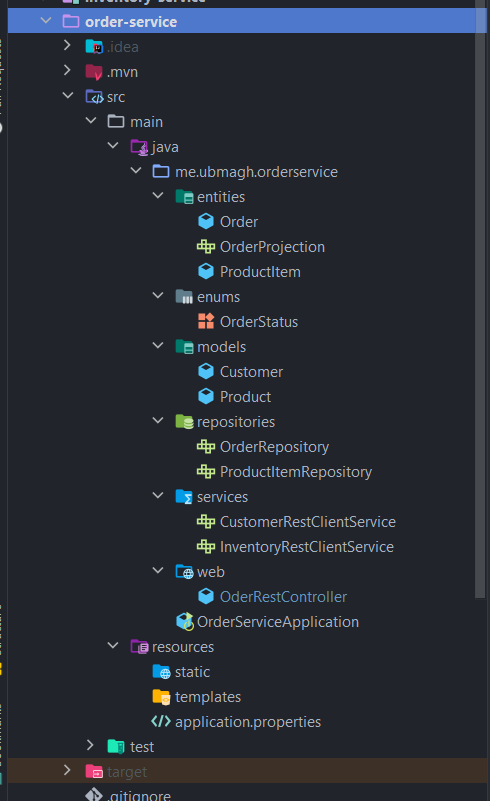

[👈 Retourner ](../)

# Order service :


## stack & Packages :

```
java : 17-Maven
spring : 2.7.5
packages : 
    - spring cloud : 2021.0.4
    - spring-boot-starter-data-jpa
    - spring-boot-starter-data-rest
    - spring-cloud-starter-consul-discovery => S'enregistrer dans le service d'enregistrement de [consul-service](../Consul/)
    - com.h2database/h2
    - spring-boot-starter-web
    - org.projectlombok/lombok : 1.18.24
    - spring-boot-starter-actuator
    - spring-cloud-starter-config => récupérer la configuration depuis [config-service](../config-service/)
    - spring-cloud-starter-openfeign
```
-> Voir le fichier : [📦 pom.xml ](./pom.xml)

<br>

## Configuration : 

```porperties
server.port=8003
spring.application.name=order-service
spring.config.import=optional:configserver:http://localhost:8888
```
[⚙ application.properties ](./src/main/resources/application.properties)


=> La configuration va être importée depuis le [service de configuration](../config-service/), et certains élément vont être (overrided) changés. 

<br>

## Application : 

### ℹ Project structure ; 

<p align="center">
    
</p>

<br>

### 💻 Data Layer : 

* l'entité : `Order` :

```java
@AllArgsConstructor
@NoArgsConstructor
@Data
@Entity
@Builder
@Table(name = "orders")
public class Order {

    @Id
    private String id;
    private Date createdAt;
    private OrderStatus status;
    private String customerId;

    @Transient
    private Customer customer;

    @OneToMany(mappedBy = "order")
    private List<ProductItem> productItems=new ArrayList<ProductItem>();

    public double getTotal(){
        double somme=0;
        for(ProductItem pi:productItems){
            somme+=pi.getAmount();
        }
        return somme;
    }
}
```
[👉 Order.java ](./src/main/java/me/ubmagh/orderservice/entities/Order.java)

<br>

* l'entité : `ProductItem` :

```java
@AllArgsConstructor
@NoArgsConstructor
@Data
@Builder
@Entity
public class ProductItem {
    @Id
    private String id;
    private String productId;
    private double price;
    private int quantity;
    private double discount;
    @ManyToOne
    @JsonProperty(access = JsonProperty.Access.WRITE_ONLY)
    private Order order;

    @Transient
    private Product product;

    public double getAmount(){
        return price*quantity*(1-discount);
    }
}
```
[👉 ProductItem.java ](./src/main/java/me/ubmagh/orderservice/entities/ProductItem.java)

<br>


* le repository (interface) avec l'annotation `@RepositoryRestRessource` pour créer automatiquement toutes les apis : `OrderRepository`

```java
@RepositoryRestResource
public interface OrderRepository extends JpaRepository<Order, String> {
    @RestResource(path = "/byCustomerId")
    List<Order> findByCustomerId(@Param("customerId") String customerId);
}
```
[👉 OrderRepository.java ](./src/main/java/me/ubmagh/orderservice/repositories/OrderRepository.java)

<br>


* le repository (interface) avec l'annotation `@RepositoryRestRessource` pour créer automatiquement toutes les apis : `ProductItemRepository`

```java
@RepositoryRestResource
public interface ProductItemRepository extends JpaRepository<ProductItem, String> {
}
```
[👉 ProductItemRepository.java ](./src/main/java/me/ubmagh/orderservice/repositories/ProductItemRepository.java)


<br>


* Product Projection pour les apis data-rest  (interface) :  `OrderProjection`

```java
@Projection(name="full",types = Order.class)
public interface OrderProjection {
    String getId();
    Date getCreatedAt();
    String getCustomerId();
    OrderStatus getStatus();
}
```
[👉 OrderProjection.java ](./src/main/java/me/ubmagh/orderservice/entities/OrderProjection.java)


<br>


* l'enumération : `OrderStatus`

```java
public enum OrderStatus {
    CREATED, PENDING, DELIVERED, CANCELED
}
```
[👉 OrderStatus.java ](./src/main/java/me/ubmagh/orderservice/enums/OrderStatus.java)


<br>
<br>

### Modèles pour le mapping des objets en relation avec les deux entités en haut : 

* La classe `Customer` : 
```java
@AllArgsConstructor
@NoArgsConstructor
@Data
@Builder
public class Customer {
    private String id;
    private String name;
    private String email;

}
```
[👉 Customer.java ](./src/main/java/me/ubmagh/orderservice/models/Customer.java)

<br>

* La classe `Product` : 
```java
@AllArgsConstructor
@NoArgsConstructor
@Data
@Builder
public class Product {
    private String id;
    private String name;
    private double price;
    private int quantity;
}
```
[👉 Product.java ](./src/main/java/me/ubmagh/orderservice/models/Product.java)

<br>


### 🔁 BusinessLogic Layer : 

<br>

> Automatisé par l'ajout de Data-rest

> en plus , nous avons utilisé Feign pour contacter les autres microservices : 

* le service `CustomerRestClientService` pour contacter le microservice [Customer-service](../customer-service/) : 
```java
@FeignClient(name = "customer-service")
public interface CustomerRestClientService {
    @GetMapping("/customers/{id}?projection=full")
    public Customer customerById( @PathVariable String id);

    @GetMapping("/customers?projection=full")
    public PagedModel<Customer> allCustomers();
}
```
[👉 CustomerRestClientService.java ](./src/main/java/me/ubmagh/orderservice/services/CustomerRestClientService.java)

<br>

* le service `InventoryRestClientService` pour contacter le microservice [Inventory-service](../inventory-service/) : 
```java
@FeignClient(name = "inventory-service")
public interface InventoryRestClientService {

    @GetMapping("/products/{id}?projection=full")
    public Product productById(@PathVariable String id);

    @GetMapping("/products?projection=full")
    public PagedModel<Product> allProducts();
}
```
[👉 InventoryRestClientService.java ](./src/main/java/me/ubmagh/orderservice/services/InventoryRestClientService.java)

<br>


>  Le contrôlleur  `OrderRestController` qui défini une api pour exploiter les 2 services déjà définies pour récupérer une commande(Order) entière : 

```java
@RestController
public class OrderRestController {

    private OrderRepository orderRepository;
    private ProductItemRepository productItemRepository;
    private CustomerRestClientService customerRestClientService;
    private InventoryRestClientService inventoryRestClientService;

    public OrderRestController(OrderRepository orderRepository, ProductItemRepository productItemRepository, CustomerRestClientService customerRestClientService, InventoryRestClientService inventoryRestClientService) {
           this.orderRepository = orderRepository;
        this.productItemRepository = productItemRepository;
        this.customerRestClientService = customerRestClientService;
        this.inventoryRestClientService = inventoryRestClientService;
    }

    @GetMapping("/fullOrder/{id}")
    public Order getOrder(@PathVariable String id){
        Order order=orderRepository.findById(id).get();
        Customer customer=customerRestClientService.customerById(order.getCustomerId());
        order.setCustomer(customer);
        order.getProductItems().forEach(pi->{
            Product product=inventoryRestClientService.productById(pi.getProductId());
            pi.setProduct(product);
        });
        return order;
    }
}
```
[👉 OrderRestController.java ](./src/main/java/me/ubmagh/orderservice/web/OrderRestController.java)


<br>

<br>


### 🚀 main application : 

* Main app class `~/OrderServiceApplication.java` contains along with server launch, a bean to insert some data to the H2 database :


```java
@SpringBootApplication
@EnableFeignClients
public class OrderServiceApplication {

    public static void main(String[] args) {
        SpringApplication.run(OrderServiceApplication.class, args);
    }

    @Bean
    CommandLineRunner start(
            OrderRepository orderRepository,
            ProductItemRepository productItemRepository,
            CustomerRestClientService customerRestClientService,
            InventoryRestClientService inventoryRestClientService){
        return args -> {
            List<Customer> customers=customerRestClientService.allCustomers().getContent().stream().toList();
            List<Product> products=inventoryRestClientService.allProducts().getContent().stream().toList();
            String customerId= customers.get(0).getId();
            Random random=new Random();
            Customer customer = customerRestClientService.customerById(customerId);
            for (int i = 0; i <20 ; i++) {
                Order order=Order.builder()
                        .id(UUID.randomUUID().toString())
                        .customerId(customers.get(random.nextInt(customers.size())).getId())
                        .status( Math.random()>0.5 ? OrderStatus.PENDING:OrderStatus.CREATED)
                        .createdAt(new Date())
                        .build();
                Order savedOrder = orderRepository.save(order);
                for (int j = 0; j < products.size() ; j++) {
                    if(Math.random()>0.70){
                        ProductItem productItem=ProductItem.builder()
                                .id(UUID.randomUUID().toString())
                                .order(savedOrder)
                                .productId(products.get(j).getId())
                                .price(products.get(j).getPrice())
                                .quantity(1+random.nextInt(10))
                                .discount(Math.random())
                                .build();
                        productItemRepository.save(productItem);
                    }
                }
            }
        };
    }
}
```

[👉 OrderServiceApplication.java ](./src/main/java/me/ubmagh/orderservice/OrderServiceApplication.java)


<br>

<br>

> end .<